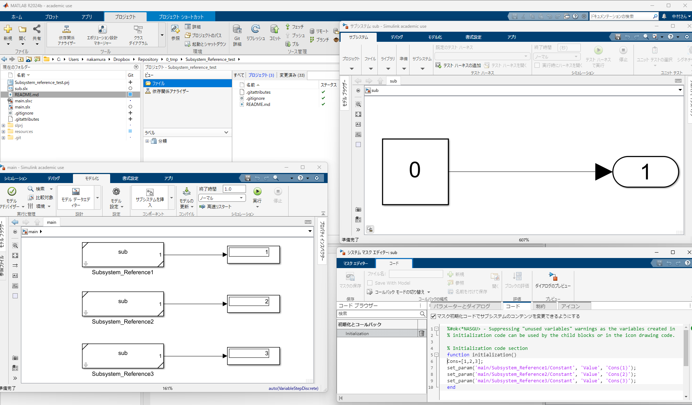

# サブシステム参照`Subsystem Reference`におけるブロック毎のパラメータ設定

## 概要

このプロジェクトは、Simulinkモデルにおけるサブシステムリファレンス機能の使用例を示すためのものです。`main.slx`モデルを通して、外部の
サブシステムを参照し、異なるパラメータ設定でモデルがどのように動作するかを確認できます。

## 含まれるファイル

- `main.slx`: メインのSimulinkモデル
  - 外部のサブシステムを参照
  - 異なるパラメータ設定での挙動を示す
- `sub.slx`: 参照されるサブシステムモデル
  - メインモデルから参照される外部サブシステム
  - パラメータ化された処理ブロックを含む

## 使用方法

1. このプロジェクトをMATLABで開きます
2. `main.slx` モデルを開きます（図左下）
3. モデル内のサブシステムリファレンスブロックのマスクを表示し、コードにあるパラメータ`Cons`の値を変更する（図右下）
4. `Display`ブロックを使って、対応する`Cons`の値になっているかを確認

右上はサブシステム（定数ブロックの値は0）であるが、`main`モデルを実行すると右下のマスクによりパラメータセットされた値が表示される。